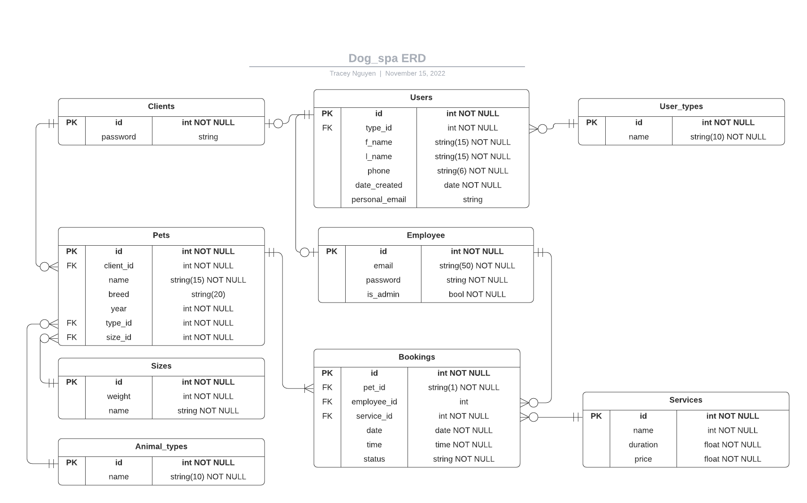

[Link to GitHub](https://github.com/Thi-Tracey-Nguyen/T2A2)

# The problem (Q1)  

Every business needs a reliable and efficient system to manage their clientele, workers and bookings. The purpose of this API application is to provide all-in-one management solution to a business that has the clients, staff and bookings as the core of their business model.  

With this application, users interact with the database using user-friendly RESTful API calls. Problems that can be solved by this application are:  
* Client management: adding, removing clients and reading or updating their information. 
* Staff management: adding, removing, reading and updating their information
* Booking management: adding, removing, reading and updating bookings
* Pet management: adding, removing, reading and updating pets
* Data security: by authentication measures such as password log-in and authorization by multi-tired user privilege. 
* Data integrity: by valiation methods so that inputs are sanitized before being updated in the database. 

# Why do the problems need solving (Q2)  

Having a well-designed and user-friendly management system is essential to the operations of any business. It streamlines customer interactions, saves time and increases customer satisfaction.  

Similarly, proper staff and booking management ensure work load is distributed evenly amongst employees.

Data security provided with the application is important in protecting staff and clients' information from data breaches as well as ensuring the correctness of data in the database. 

# Database system (Q3)  
   
Database system chosen for the application is PostgreSQL due to the following advantages:
* Open source (free)
* Compatible on all platforms (windows, Linux, MacOS)
* Widely used, supported and documented
* Strong reputation for reliability, scalability, extensibility and data integrity.
* Tools such as psycopg2 helps matching Python and PostgreSQL data types for seamless development process.

Drawbacks compared to other databases
* Memory performance: each client connection is forked as a new process, which is allocated about 10MB of memory. As a result, for read-heavy operations, PostgreSQL's preformance is inferior to other RDBMSs, like MySQL

* Popularity: compared to MySQL, PostgreSQL is still less popular, despite recently became more widely used. As a result, there are not as many third-party tools for database management, as well as administrators with experience compared to MySQL. 

# ORM (key functionalities and benefits) (Q4)
ORM stands for Object Relational Mapper, which supports the interactions between an application and its database.  

The chosen ORM for the project is SQLAlchemy because it is database-agnostic (which means it can be flexibily used with any databases), and it is highly compatible with Flask and Python.  

Key functionalities of ORM: 
- With the use of an ORM, instead of tables, entities are Python classes which extend the ORM's model class (db.Model), and they behave like a Python classes i.e. a database 'record' is an object, or an instance of the class. Examples provided using SQLAlchemy.

```py
class Client(db.Model): 
    class Client(db.Model):
    __tablename__ = 'clients'

    id = db.Column(db.Integer, db.ForeignKey('users.id'), primary_key=True)
    email = db.Column(db.String)
    password = db.Column(db.String)
```

    * A record is declared just like an object 

```py
    client = Client(
        email = 'admin123@spam.com',
        password = 'Admin890!'
    )
```

    * Table's columns become attributes of the class with the use of an ORM. ORM's datatypes are similar to that of Python: String, Integer, Float, Boolean, etc. 

```py
password = db.Column(db.String)
```

    * Foreign keys are instances for ForeignKey class

```py
phone = db.Column(db.Integer, db.ForeignKey('users.phone'))
```

    * Relationships between tables are represented by relationship method

```py
pets = db.relationship('Pet')
```

- Functions are converted to SQL by ORM

Python function:
```py
    def select_user():
        stmt = db.select(User).filter_by(id = 8)
        user = db.session.scalar(stmt)
        return user.name
```
The SQL equivalent of it is:
```SQL
    select name from users where id = 8;
```

- It supports actions such as select, query, commit, delete, add, update just like how the user would interact with a database using SQL.

```py
    stmt = db.select(Users).where(db.or_(User.id == 2), (phone == request.json['phone']))
    user = db.session.scalar(stmt)
    db.session.delete(user)
    db.session.commit()
```

Key benefits of an ORM are:
- It allows the developers to query and manipulate database using object-oriented programming language, therefore, it reduces the length and complexity of code compared to embedded SQL.
- It makes the development process easier because developers do not need to switch between OOP and SQL.  
- It has great support for tasks such as connections, seeds and migrations. As a result, implementation is straightforward. 
- It protects data from direct SQL injections because does not take explicit SQL queries and requires all interactions performed on OOP objects instead of database tables.
- It is database-agnostic which makes switching from one database (for development) to another one (for deployment) seamless whilst keeping the code base consistent. 

# Endpoints documentation (Q5)
Endpoints documentation can be found [here](/docs/Endpoints.md)

# ERD of the app (Q6)


# Detail any third party services in the app (Q7)

1. Web framework: Flask, which is a microframework used to develop web applications in Python. It comes with a built-in development server and has a fast debugger. Flask 2.2.2 is used in this application.

2. Object Relational Mapper: SQLAlchemy - facilitates the communication between Python programs and the database (PostgreSQL in this case). It translates database tables into Python objects, and converts function calls into SQL statements. In the app, Flask - SQLAlchemy is used, because it is specifically designed to work with Flask, making SQLAlchemy compatible with a Flask app. The version of SQLAlchemy is 1.4.42 and Flask-SQLAlchemy in the app is 3.0.2.

3. Serialization and deserialization library: Marshmallow - it is framework-agnostic, and it helps convert complex datatypes into native Python datatypes. Marshmallow version in the app is 3.18.0. In this app, Flask - Marshmallow is used because it comes with additional features to make Marshmallow fully compatible with a Flask app, and marshmallow-sqlalchemy is another package that integrates SQLAlchemy and Marshmallow. The version of Flask-Marshmallow is 0.14.0, and marshmallow-sqlalchemy is 0.28.1

4. PostgreSQL and Python adapter: psycopg2, its functions are to match Python data types with PostgreSQL datatypes. It also comes with thread safety feature which is desireable in heavily multi-threaded applications that make a large number of concurrent "INSERT"s or "UPDATE"s. The version of psycopg2 used in the app is 2.9.4

5. Hashing utility: Bcrypt - its special feature is slow hashing, which prevents brute force attacks on sensitive data such as passwords. In the app, Flask-Bcrypt is used because it comes fully compatible with a Flask app. The version of Flask-Bcrypt is 1.0.1. 

6. Authorization: JSON Web Token (JWT), provides a secure and compact tool for user authentication. Once logged in, a token will be generated and it will be included in all subsequent requests made by the client, and allows them access to routes, services and resources that are permitted with that token. In the app, the secret key method of signing is used, and Flask-JWT-Extended is required extension, its version is 4.4.4

# Describe project models (Q8)
There are 9 models in the project, they are: User, Client, Employee, Pet, Booking, Sizes, Animal_type, UserType,and Service.  


1. User model: 

Relationship with UserType model: one and only one to zero or many. The type_id is a foreign key, which links to the user_types.id in the UserType model. When a user_type is deleted, all associated users will be deleted.

Relationship with Client model: zero or one to one and only one. A user can be linked to one client or none (if the user is an employee) and a client can be linked to one and only one user. When a user is deleted, its associated client will also be removed.

Similarly, User model has zero or one to one and only one relationship. When a user is a client, they don't own an employee record, and one employee can only be linked to one and only one user. When a user is deleted, its associated employee will also be removed.

Model declaration:
```py
    type_id = db.Column(db.Integer, db.ForeignKey('user_types.id'), nullable=False)
    
    type = db.relationship('UserType', back_populates = 'users')
    client = db.relationship('Client', back_populates = 'user', cascade = 'all, delete')
    employee = db.relationship('Employee', back_populates = 'user', cascade = 'all, delete')
```

Schema declaration:  
```py
    type = fields.Nested('UserTypeSchema', only = ['name'])
    employee = fields.Nested('EmployeeSchema', only = ['email', 'is_admin'])
```

In the UserSchema, TypeSchema and EmployeeSchema are nested, so that when the user is called, the returned is result is more meaningful, because it has type name, email address of the employee and tells if they are an admin not. ClientSchema is not nested because it only contains password, which the user is not supposed to see. 

2. Client model: 

Relationship with User model: one and only one to zero or one relationship. When a client is deleted, its associated user record will also be removed.

Relationship with Pet model: zero or many to one and only one relationship. Ideally, a client can not exist in the database without a pet, but there are cases where a client owns more than one pet, and removing a pet should not remove the client from the database. As a result, cascade delete only goes one way in the relationship: if the client is deleted, their associated pets will be reomoved, but not vice versa.

Id is both a foreign key and primary key. It is linked to the id column in the User model, hence it is unique.

Model declaration:
```py
    id = db.Column(db.Integer, db.ForeignKey('users.id'), primary_key=True)

    user = db.relationship('User', back_populates = 'client', cascade = 'all, delete')
    pets = db.relationship('Pet', back_populates = 'client', cascade = 'all, delete')
```

Schema declaration:
```py
    user = fields.Nested('UserSchema', exclude = ['employee', 'id'])
    pets = fields.List(fields.Nested('PetSchema', exclude = ['client']))
```

In the ClientSchema, UserSchema and PetSchema are nested. 'Employee' field is excluded to avoid circular imports,  and 'id' fields are excluded because it is the same as client's id. Similarly, 'client' field is excluded from PetSchema to avoid circular imports, and PetSchema is a list because a client can have many pets.

3. Employee model: 

Relationship with User model: one and only one to zero or one relationship. When an employee is deleted, its associated user record will also be removed.

Relationship with Booking model: zero or many to one and only one relationship. An employee can have many bookings, or none (if they just started), and a booking can only belong to one and only one employee. When an employee is deleted, employee_id field in the Booking model will be set to null. 

Id is both a foreign key and primary key. It is linked to the id column in the User model, hence it is unique.

Model declaration:
```py
    id = db.Column(db.Integer, db.ForeignKey('users.id'), primary_key = True)

    user = db.relationship('User', cascade = 'all, delete')
    bookings = db.relationship('Booking', back_populates = 'employee')
```

Schema declaration:
```py
    user = fields.Nested('UserSchema', exclude = ['employee'])
    bookings = fields.List(fields.Nested('BookingSchema', exclude = ['employee']))
```

In the EmployeeSchema, UserSchema, and BookingSchema are nested to provide more information about the employee. For example, the UserSchem has f_name, l_name, and phone and BookingSchema shows all bookings made with the employee. 'Employee' field has to be excluded in all cases to avoid circular imports. BookingSchema is a list because an employee can have multiple bookings.

4. UserType model:

Relationship with User model: zero or many to one and only one relationship. A user_type can be used for zero or many users, but a user can only be of one and only one type. When a user_type is removed, type_id in the User model will be set to null, but when a user is deleted, it has no impacts on user_types. 

Model declaration:
```py
    users = db.relationship('User', back_populates = 'type', cascade = 'all, delete')
```

Schema declaration:
```py
    users = fields.List(fields.Nested('UserSchema', exclude=['type']))
```

In the UserTypeSchema, UserSchema is nested, so if a user_type is called, all users who are of that type will be shown. It is a list because there can be many users who fall into one type category.

5. Pet model:  

Relationship with Client model: zero or many to one and only one relationship. A client can have many or none pet (the pet passed away), but a pet can only belong to one and only one client. When a client is removed, all their associated pets will also be removed, but when a pet id removed, it has no impacts in the client. The client_id is a foreign key which links to the Client model. 

Relationship with Size model: one and only one to zero or many relationship. A pet can only be of one and only one size, but a size can be used by many pets or none at all. When a size is removed, corresponding pets will be removed, but when a pet is removed, it does not impact Size model. The size_id is a foereign key in the Pet model and links to the Size model. 

Relationship with Type model: one and only one to zero or many relationship. A pet can only be of one and only one type, but a type can be used by many pets or none at all. When a type is removed, corresponding pets will be removed, but when a pet is removed, it does not impact Type model. The type_id is a foereign key in the Pet model and links to the Type model. 

Relationship with Booking model: one or many to one and only one relationship. A pet must have at least one booking to be in the database, but they can only have many bookings. On the other hand, a booking can only belong to one and only one pet. When a pet is deleted, associated bookings will be removed, but removing a booking does not have any impacts on the pet.

The combination of pet's name, client_id and type_id has to be unique to avoid having duplications of the same pet in the database.

Model declaration:
```py
    type_id = db.Column(db.Integer, db.ForeignKey('pet_types.id'), nullable=False)
    size_id = db.Column(db.Integer, db.ForeignKey('sizes.id'), nullable=False)
    client_id = db.Column(db.Integer, db.ForeignKey('clients.id'))

    __table_args__ = (db.UniqueConstraint('name', 'client_id', 'type_id'),)

    client = db.relationship('Client', back_populates = 'pets')
    bookings = db.relationship('Booking', back_populates = 'pet', cascade = 'all, delete')
    type = db.relationship('PetType')
    size = db.relationship('Size')
```

Schema declaration:
```py
    client = fields.Nested('ClientSchema', only = ['user', 'id'])
    type = fields.Nested('PetTypeSchema', only = ['name'])
    size = fields.Nested('SizeSchema', only = ['name'])
    bookings = fields.List(fields.Nested('BookingSchema', exclude = ['pet']))
```

In the PetSchema, ClientSchema, PetTypeSchema, SizeSchema and BookingSchema are nested to provide all information regarding the pet. BookingSchema is a list because a pet can have many bookings. 'Pet' field is excluded from BookingSchema to avoid circular imports.

6. Size model:
Relationship with Pet model: zero or many to one and only one relationship. A size can be used for many pets or none at all, but a pet can only be of one and only one size. When a size is deleted, all pets of that size will also be removed (refuse service to one particular size of pets).

Model declaration:
```py
    pet = db.relationship('Pet', back_populates = 'size', cascade='all, delete')
``` 

Schema declaration:
```py
    pets = fields.List(fields.Nested('PetSchema', exclude = ['size']))
```

In the SizeSchema, PetSchema is nested so when a size is called, all pets who is of that size will also be shown. 'Size' field is excluded from PetSchema to avoid circular imports.

7. Type model:
Relationship with Pet model: zero or many to one and only one relationship. A type can be used for many pets or none at all, but a pet can only be of one and only one type. When a type is deleted, all pets of that type will also be removed (refuse service to one particular type of pets).

Model declaration:
```py
    pet = db.relationship('Pet', back_populates = 'size', cascade='all, delete')
``` 

Schema declaration:
```py
    pets = fields.List(fields.Nested('PetSchema', exclude = ['type']))
```

In the TypeSchema, PetSchema is nested so when a type is called, all pets who is of that type will also be shown. 'Type' field is excluded from PetSchema to avoid circular imports.

8. Booking Model
Relationship with Pet model: one and only one to one or many. A pet can have one or many bookings (has to have at least one), and a booking can only be booked for one and only one pet. When a pet is deleted, all associated bookings will also be removed, but when a booking is deleted, it has no effect on the pet (one way cascade delete). Pet_id is a foreign key that links the Booking model to the id colummn in Pet model.

Relationship with Employee model: one and only one to zero or many. An employee can have zero or many bookings, and a booking can only be booked for one and only one employee. When an employee is deleted, employee_id in the Booking model is set to null. When a booking is deleted, it has no effect on the employee (one way cascade delete). Employee_id is a foreign key that links the Booking model to the id column in Employee model.

Relationship with Service model: one and only one to zero or many. A booking can be booked for one and only one service, and a service can be used in zero (new service just got added) or many bookings. When a service is deleted, related bookings will also be removed, but when a booking is deleted, it has no effect on the service. Service_id is a foreign key that links the Booking model to the id column in Service model.

The combination of pet_id, date and time is unique to avoid double booking. 

Model declaration:

```py
    pet_id = db.Column(db.Integer, db.ForeignKey('pets.id'), nullable=False)
    employee_id = db.Column(db.Integer, db.ForeignKey('employees.id', ondelete='SET NULL'))
    service_id = db.Column(db.Integer, db.ForeignKey('services.id'), nullable=False)

    __table_args__ = (db.UniqueConstraint('pet_id', 'date', 'time'),)

    pet = db.relationship('Pet', back_populates = 'bookings')
    employee = db.relationship('Employee')
    service = db.relationship('Service', back_populates = 'bookings')
```

Schema declaration: 

```py
    pet = fields.Nested('PetSchema', exclude = ['bookings'])
    service = fields.Nested('ServiceSchema', exclude = ['id', 'bookings'])
    employee = fields.Nested('EmployeeSchema', only = ['user'])
```

In the BookingSchema, PetSchema, ServiceSchema and EmployeeSchema are nested, so when a booking is called, all information on the pet, the groomer and the service are also presented. 'Bookings' field are excluded from PetSchema and ServiceSchema to avoid circular imports.

9. Service Model
Relationship with Booking model: one and only to zero or many. A service can be used in zero or many bookings, and a booking can only be made for one and only one service. When a service is deleted, related bookings are also removed.

Model declaration:

```py
    bookings = db.relationship('Booking', back_populates = 'service', cascade = 'all, delete')
```

Schema declaration:

```py
    bookings = fields.List(fields.Nested('BookingSchema', exclude=['service']))
```

In the ServiceSchema, BookingSchema is nested and it is a list because there are many bookings associated with a service type. 


# Discuss the database relations (Q9)
There are 9 relations/tables in the database.  

1. Users table - includes all the users, they are divided into 2 types: employees and clients. 
* Attributes in the users table are: id (serial, not null, primary key), f_name (string, not null), l_name (string, not null), phone (string, not null and unique), personal_email (string, optional), and date created (date data type, automatically set to current date). 
* When a user is deleted, the associated fields in the clients and employees table are also deleted (cascade delete)
* Foreign key is type_id (int, not null), which links to the user_types table. On delete, related records are to be removed.
* Relationships: 
  * users - clients: zero or one to one and only one relationship
  * users - employees: zero or one to one and only one relationship
  * users - user_types: one and only one to zero or many relationship

2. Clients table - includes all the users who are clients. 
* Attributes of the clients table are: id (which is also user_id, serial, primary key), password (string, optional). If a client wants to make bookings online, or edit their profile, track their bookings, they need to sign up. If a client does not sign up, password field will be null. Passwords are stored as hashed in the database.
* When a client is removed, their associated info in the users table will also be removed (cascade delete).Similarly, any pets they own, will also be removed (cascade delete).
* Relationships: 
  * clients - users: one and only one to one and only one relationship
  * clients - pets: zero or many to one and only one relationship

3. Employees table - includes all the users who are employees. 
* Attributes of the employees table are: id (which is also user_id, serial, primary key), email (string, not null), password (string, not null), is_admin (boolean, not null, default is 'False'). Passwords are stored as hashed.
* When an employee is removed, their associated info in the users table will also be removed (cascade delete)
* Relationships: 
  * employees - users: one and only one to zero or one relationship
  * employees - bookings: zero or many to one and only one relationship

4. User_types table - information on user types. There are 2 types: client and employee 
* Attributes of the user_types table are: id (serial, primary key), name (string, not null). 
* When a user type is deleted, all related records in users table will be removed (cascade delete).
* Relationship: user_types - users: zero or many to one and only one relationship. 

5. Pets table - includes all clients' pets. It is important to know the type and size of the animal because they influence the time required to groom it. The age of the pet is also worth knowing as some older animals are prone to having heart attacks. 
* Attributes of the pets table are: id (serial, primary key), name (string, not null), breed (string, optional, default: unknown), year (int, not null) 
* Foreign keys: client_id (int, not null), size_id (int, not null), type_id (int, not null)
* When a client is deleted, associated pets will be removed (cascade delete), but when the pet is removed, the client can stay in the database as they may own other pets.
* Relationships: 
  * pets - clients: zero or many to one and only one relationship. A pet can belong to one and only one client, but a client can have many pets, or zero if the pet passed away.
  * pets - sizes: one and only one to zero or many relationship. A pet can only be of one and only one size, and a size can be set for many pets or zero if no pets fall into the size range.
  * pets - types: one and only one to zero or many relationship. A pet can only be of one and only one type (cat or dog or duck), and a type can be set for many pets or zero if no pets fall into the type category.
  * pets - bookings: one or many to one and only one relationship. A pet can have one or many bookings, but it cannot be in the system without any bookings. A booking can only belong to one and only one pet. 

6. Sizes table: information on animal's weights and corresponding sizes. This information is important because it influences the time needed to groom the animal. 
* Attributes are: id (serial, primary key), weight (string, not null), size (string, nut null). 
* Relationship:
  * sizes - pets: zero or many to one and only one relationship. A pet can be of only one size, but a size can be used for many pets, or none at all. 

7. Animal_types table: information on the types of pets
* Attributes are: id (serial, primary key), name (string, not null)
* Relationship: 
  * animal_types - pets: zero or many to one and only one relationship. A type can be used in for many pets or none at all (new type that just got added), but a pet can be of one and only one type. 

8. Bookings table - includes all bookings. 
* Attributes are: id (serial, primary key), date (date, not null), time (time, not null), status (string, not null). Booking date and time have to be in the future. Valid statuses are: pending, in progress and completed. 
* Foreign keys are: pet_id (int, not null), employee_id (int, default is null), service_id (int, not null). A client can choose to book with a specific employee, if not specified, whoever works on the day will do the job. 
* When a pet is deleleted, all associated bookings will also be removed (cascade delete). When an employee is deleted, the employee_id field in associated bookings will be set to null. 
* Relationships: 
  * bookings - pets: one or many to one and only one relationship. A booking can only associate with one and only one pet, a pet can have one or many bookings. 
  * bookings - employees: one and only one to zero or many relationship. A booking can only associate with one and only one employee, but an employee can have many bookings or none at all (if they just started). 
  * bookings - services: one and only one to zero or many relationship. A booking can only be booked for one and only one service, but a service can be used in many bookings, or none at all. 

9. Services table - information on the services available at the salon
* Attributes are: id (serial, primary key), name (string, not null), duration (float, not null), price (float, not null). 
* Relationship: 
  * services - bookings: zero or many to one and only one relationship. A service can be booked for many bookings or none at all (example: a new service), and a booking can only be booked for one and only one service. 

# Planning and tracking of tasks (Q10)

The project is divided into three main parts:
* Initial planning
* Writing code & testing
* Writing documentation 

Initial planning includes:
1. Brainstorming ideas for an application that is meaningful and suitable to my skill level. 
2. Get approval for the idea
3. What features to be included in the app
4. What entities that need tracking to achieve the said features
5. What are the relationships between said entities
6. What are the API endpoints
7. What are the CRUD operations that are appropriate for each entity
8. What is the Database Management System to be used

Task #1: Create the skeletal structure of the application
* Code: create a virtual environment, install all the required dependencies, initialize the application, a PostgreSQL database, and a git repository.
* Testing: test the index route (landing page)
* Documentation: complete R1, R2, R3 of the documentation requirements 

Task #2 - #10: Build each entity (including a model, a seeded table, and a controller) for 9 entities
* Code: create the model and schema, cli command to create and seed the table in the database. Also a controller for routes. 
* Testing: make sure routes work

Task #11: error handlers and validations for all 9 entities
* Code: add validation and error handlers for all entities
* Testing: make sure everything works


Task #12: authorization
* Code: add authorization controller and add jwt_required on necessary routes
* Testing: make sure required routes are protected

Task #13: finish up documentation

Tool to track progress: [Trello](https://trello.com/b/ZANZ6fH9/web-development)